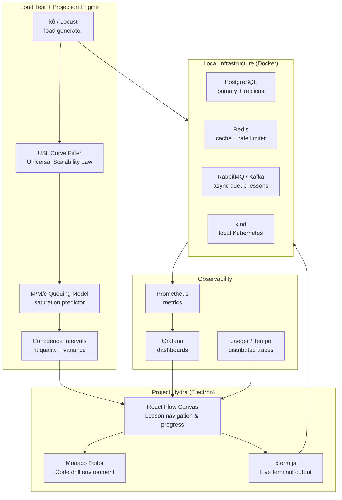
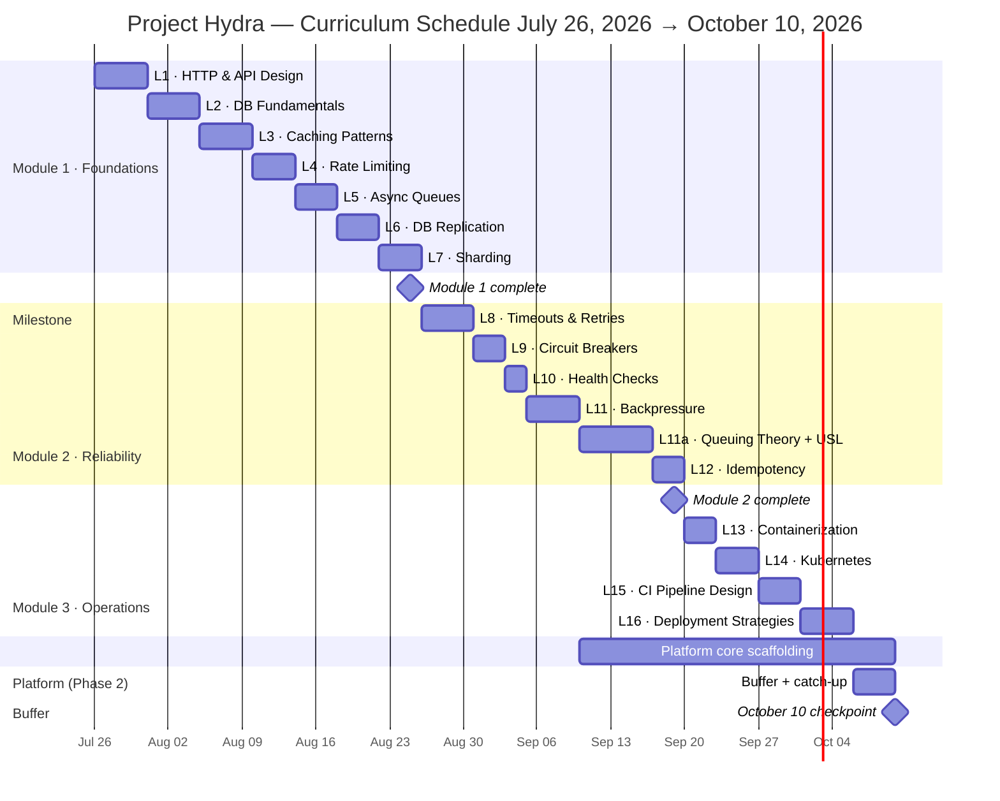
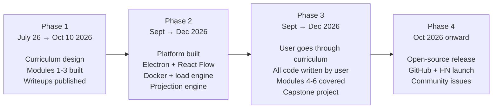

# Project Hydra

> **Learn backend scale engineering by building it.**

Project Hydra is a hands-on platform where you implement real scale primitives — rate limiters, caching layers, sharding strategies, deployment pipelines — run them under realistic load against real Docker containers, hit real failure modes, and measure the results. A mathematically grounded projection engine (Universal Scalability Law + queuing theory) takes real measurements at laptop-scale and projects behavior at higher load with explicit confidence intervals.

---

## Table of Contents

- [What is Project Hydra](#what-is-project-hydra)
- [Why it exists](#why-it-exists)
- [Platform Architecture](#platform-architecture)
- [Curriculum](#curriculum)
- [Schedule](#schedule)
- [Deliverables](#deliverables)
- [Future Expansion — Modules 4–6](#future-expansion--modules-46)
- [Projects](#projects)
- [Tech Stack](#tech-stack)
- [Phases](#phases)
- [Blog](#blog)

---

## What is Project Hydra

Most backend engineers can describe how a system scales. Project Hydra is for engineers who want to understand *why* — by building it themselves.

The platform is organized around named, realistic projects: a URL shortener at extreme scale, a Twitter-style timeline, a payment processor, a real-time matching system. Each project is decomposed into drill lessons where you implement one component at a time: the rate limiter, the read replica routing layer, the async worker queue, the canary deployment. You run your implementation under load, watch it break, measure the numbers, and compare against a reference solution.

The platform handles scaffolding — spinning up containers, running load tests, collecting metrics. You write the code.

What makes it distinct:

- **Real containers, real load.** Every lesson runs against actual Docker services. Metrics come from Prometheus. Failures are real.
- **Projection engine.** A USL-based projection model takes 4–6 real measurements at achievable load and projects behavior at 10× and 100× scale with confidence intervals — so you can reason about scale without access to production infrastructure.
- **Curriculum depth.** Each lesson is built around primary sources: papers, engineering postmortems, SRE books — not blog post summaries.

---

## Why it exists

There is a well-documented gap in backend engineering education. Most resources teach either:

- **Features** — how to build something that works
- **Vocabulary** — how to describe systems at scale in an interview

Neither teaches scale engineering as a practical skill. The conventional path to acquiring it is to work at a company with large-scale infrastructure. That path is not accessible to everyone, and the gap compounds over time.

Project Hydra exists for two reasons:

**For the builder:** The most reliable way to internalize distributed systems concepts is to implement them, break them under load, and fix them. Reading DDIA is not the same as watching your sharding layer fall over at 4,000 RPS and figuring out why.

**For others:** Engineers who want to close the gap between "I can describe a system" and "I can build and operate one" should not need to be hired first. A structured, project-driven path that doesn't require institutional access benefits a large number of people.

---

## Platform Architecture



### Projection Zones

| Zone | Load range | Confidence | Visual |
|---|---|---|---|
| Measured | 1K–10K RPS | Ground truth | Solid |
| Near projection | Up to 10× measured | ±20–30% | Translucent |
| Far projection | 10× to 100× | Low — labeled explicitly | Desaturated + error bars |
| Beyond 100× | — | Refused | Architectural recommendations shown instead |

---

## Curriculum

30 lessons across 6 modules. Each lesson has a concept, a build exercise, primary source readings, and a load test checkpoint.

```mermaid
flowchart LR
    subgraph M1["Module 1 · Foundations"]
        direction TB
        L1["L1 · HTTP & API Design"]
        L2["L2 · DB Fundamentals"]
        L3["L3 · Caching Patterns"]
        L4["L4 · Rate Limiting"]
        L5["L5 · Async Queues"]
        L6["L6 · DB Replication"]
        L7["L7 · Sharding"]
    end

    subgraph M2["Module 2 · Reliability"]
        direction TB
        L8["L8 · Timeouts & Retries"]
        L9["L9 · Circuit Breakers"]
        L10["L10 · Health Checks"]
        L11["L11 · Backpressure"]
        L11a["L11a · Queuing Theory + USL"]
        L12["L12 · Idempotency"]
    end

    subgraph M3["Module 3 · Operations"]
        direction TB
        L13["L13 · Containerization"]
        L14["L14 · Kubernetes"]
        L15["L15 · CI Pipeline Design"]
        L16["L16 · Deployment Strategies"]
        L17["L17 · Config & Secrets"]
        L18["L18 · Terraform IaC"]
        L19["L19 · Incident Response"]
    end

    subgraph M4["Module 4 · Observability"]
        direction TB
        L20["L20 · Structured Logging"]
        L21["L21 · Metrics: RED/USE/SLO"]
        L22["L22 · Distributed Tracing"]
        L23["L23 · Alerting Design"]
    end

    subgraph M5["Module 5 · Distributed Systems"]
        direction TB
        L24["L24 · Consistency Models"]
        L25["L25 · Consensus & etcd"]
        L26["L26 · Distributed Transactions"]
        L27["L27 · Database Choice"]
    end

    subgraph M6["Module 6 · Advanced"]
        direction TB
        L28["L28 · Security & Auth"]
        L29["L29 · Kafka & Streaming"]
        L30["L30 · Cost Optimization"]
    end

    PA["Project A\nURL Shortener"]
    PB["Project B\nTwitter Timeline"]
    PC["Project C · Real-time Chat"]
    PD["Project D · Payment Processor"]
    PE["Project E · Real-time Matching"]
    PF["Project F · YouTube Live"]

    M1 --> M2
    M2 --> M3
    M3 --> M4
    M4 --> M5
    M5 --> M6

    M2 -.->|"unlocks"| PA
    M4 -.->|"unlocks"| PB
    M5 -.->|"unlocks"| PC
    M5 -.->|"unlocks"| PD
    M5 -.->|"unlocks"| PE
    M6 -.->|"unlocks"| PF
```



### Lesson depth

Each lesson is classified as **deep** (~1 week, 3,000–5,000 word writeup, primary sources) or **short** (~2–3 days, 1,000–1,500 words, reference quality).

| Module | Deep lessons | Short lessons |
|---|---|---|
| M1 · Foundations | L1, L2, L3, L4, L5, L6, L7 | — |
| M2 · Reliability | L8, L11, L11a | L9, L10, L12 |
| M3 · Operations | L14, L15, L16, L18 | L13, L17, L19 |
| M4 · Observability | L21 | L20, L22, L23 |
| M5 · Distributed Systems | L24, L25, L26, L27 | — |
| M6 · Advanced | L28, L29 | L30 |

---

## Schedule



---

## Deliverables

### By October 10, 2026

**Curriculum**

- [ ] Module 1 · Foundations — all 7 lessons built and documented
  - [ ] L1: HTTP & API Design
  - [ ] L2: Database Fundamentals at Scale
  - [ ] L3: Caching Patterns
  - [ ] L4: Rate Limiting — all 5 algorithms
  - [ ] L5: Async Processing & Queues
  - [ ] L6: Database Replication & Read Scaling
  - [ ] L7: Sharding & Consistent Hashing

- [ ] Module 2 · Reliability — all 6 lessons + queuing theory
  - [ ] L8: Timeouts, Retries, Exponential Backoff
  - [ ] L9: Circuit Breakers & Bulkheads
  - [ ] L10: Liveness vs Readiness Health Checks
  - [ ] L11: Backpressure & Graceful Degradation
  - [ ] L11a: Capacity Planning + USL + Queuing Theory
  - [ ] L12: Idempotency at Scale

- [ ] Module 3 · Operations — lessons 13–16
  - [ ] L13: Containerization deep dive
  - [ ] L14: Kubernetes for backend engineers
  - [ ] L15: CI Pipeline Design with GitHub Actions
  - [ ] L16: Deployment Strategies (canary, blue-green, rollback)

**Platform (Phase 2 start)**

- [ ] Electron shell scaffolded
- [ ] React Flow canvas with lesson navigation
- [ ] Monaco editor integrated
- [ ] Docker API orchestration — per-lesson container lifecycle
- [ ] k6 / Locust integration
- [ ] USL curve fitter running against synthetic data
- [ ] Prometheus + Grafana wired up

---

## Future Expansion — Modules 4–6

These modules are fully designed in [`ROADMAP.md`](./ROADMAP.md) and will be covered in Phase 3. The platform infrastructure supports them from day one.

### Module 4 · Observability

| Lesson | Type | Notes |
|---|---|---|
| L20 · Structured Logging | Short | Log levels, JSON logs, aggregation, correlation IDs |
| L21 · Metrics: RED, USE, SLI/SLO + Error Budgets | Deep | Prometheus + Grafana, error budget burn alerts |
| L22 · Distributed Tracing with OpenTelemetry | Short | Spans, traces, context propagation, Jaeger |
| L23 · Alerting Design | Short | Symptom-based alerts, burn rate, avoiding alert fatigue |

### Module 5 · Distributed Systems

| Lesson | Type | Notes |
|---|---|---|
| L24 · Replication & Consistency Models | Deep | CAP, PACELC, strong vs eventual consistency |
| L25 · Consensus: Raft, etcd, Consul | Deep | When to reach for consensus systems, distributed locks |
| L26 · Distributed Transactions & Saga Pattern | Deep | 2PC limits, sagas, outbox pattern |
| L27 · Database Choice | Deep | Postgres vs DynamoDB vs Cassandra vs ClickHouse vs Redis |

### Module 6 · Advanced Topics

| Lesson | Type | Notes |
|---|---|---|
| L28 · Security & Auth at Scale | Deep | OAuth 2.0, JWT, session management, OWASP Top 10 |
| L29 · Kafka & Stream Processing | Deep | Topics, partitions, consumer groups, exactly-once semantics |
| L30 · Cost Optimization at Scale | Short | Egress costs, reserved capacity, storage classes, FinOps |

---

## Projects

Integration exercises that pull concepts from multiple modules. Each has a realistic load test scenario, a reference solution, and a writeup template. Projects are attempted in Phase 3 after the prerequisite modules are complete.

| Project | Concepts | Complexity | Prerequisite | Estimated time |
|---|---|---|---|---|
| A · URL Shortener at Extreme Scale | L1–L4, L6–L7, L13, L15, L21 | ⭐⭐ | Module 2 | 3–4 weeks |
| B · Twitter Timeline Service | L1–L3, L5–L7, L9, L13, L15, L21–L22, L27 | ⭐⭐⭐ | Module 4 | 5–6 weeks |
| C · Real-time Chat | L1, L4–L5, L7, L11, L13–L15, L21–L22, L24, L28 | ⭐⭐⭐ | Module 5 | 5–6 weeks |
| D · Payment Processor | L1–L2, L5, L8, L12, L14–L16, L19, L21, L24, L26, L28 | ⭐⭐⭐⭐ | Module 5 | 6–7 weeks |
| E · Real-time Matching (Uber-style) | L1–L3, L5, L7, L11, L13–L14, L21–L22, L26, L29 | ⭐⭐⭐⭐ | Module 5 | 6–7 weeks |
| F · YouTube Live (capstone) | All modules + CDN, transcoding, storage at scale | ⭐⭐⭐⭐⭐ | Module 6 | 8–10 weeks |

---

## Tech Stack

### Platform

| Layer | Technology |
|---|---|
| Shell | Electron |
| Canvas | React Flow |
| Code editor | Monaco Editor |
| Terminal | xterm.js |
| Styling | TailwindCSS |

### Per-lesson infrastructure (Docker-orchestrated)

| Component | Technology | Lessons |
|---|---|---|
| Primary database | PostgreSQL | L2, L6, L7, all projects |
| Cache | Redis | L3, L4, L5 |
| Message queue | RabbitMQ / Redis Streams | L5 |
| Stream platform | Apache Kafka | L29, Project E |
| Local Kubernetes | kind | L13–L16 |
| Fault injection | Pumba / Chaos Mesh | L9, L11 |

### Load testing + observability

| Component | Technology |
|---|---|
| Load generator | k6 / Locust |
| Projection engine | Python — NumPy + SciPy (USL fitting, M/M/c models) |
| Metrics | Prometheus |
| Dashboards | Grafana |
| Tracing | OpenTelemetry + Jaeger |

---

## Phases



**Phase 1 — Curriculum.** Design and build each lesson. Modules 1–3 complete by October 10.

**Phase 2 — Platform.** The platform infrastructure is built in parallel with Phase 1 curriculum work. Stack: Electron shell, React Flow canvas, Monaco editor, Docker API orchestration, k6 load test integration, USL projection engine, Prometheus + Grafana. The projection engine is the platform's primary technical differentiator — it is grounded in real queuing theory (Gunther's Universal Scalability Law) and includes explicit confidence intervals on every projection.

**Phase 3 — User implements.** The user goes through the curriculum as a learner. All code is written by the user. The platform is used as a tutor and reviewer, not a code writer. Modules 4–6 are covered here. One capstone project is completed end-to-end with load test results, failure mode documentation, and a public writeup.

**Phase 4 — Public release.** Open-source the platform and curriculum on GitHub. Light announcement. Accept issues, no SLA.

---

## Repository Structure *(Phase 2 target)*

```
project-hydra/
├── app/
│   ├── main/               # Electron main process (Docker API, file I/O)
│   └── renderer/           # React app (React Flow, Monaco, xterm.js)
├── curriculum/
│   ├── module-1-foundations/
│   ├── module-2-reliability/
│   ├── module-3-operations/
│   ├── module-4-observability/
│   ├── module-5-distributed/
│   └── module-6-advanced/
├── infrastructure/         # Docker Compose configs per lesson
├── load-engine/
│   ├── scripts/            # k6 test scripts per lesson
│   └── projection/         # USL fitting, M/M/c models, confidence intervals
├── platform/
│   ├── metrics/            # Prometheus + Grafana configs
│   └── tracing/            # OpenTelemetry + Jaeger configs
├── ROADMAP.md
└── README.md
```

---

## Blog

Writeups for each lesson are published as the curriculum is built. They cover the concept in depth — primary sources, implementation notes, and the numbers from real load tests.

[bhuvanrj.me/essays](https://bhuvanrj.me/essays)

---

*Full curriculum spec and lesson-by-lesson detail: [`ROADMAP.md`](./ROADMAP.md)*
